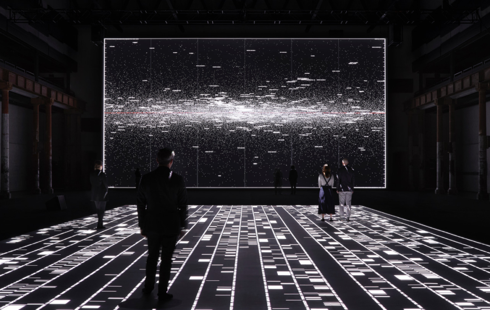
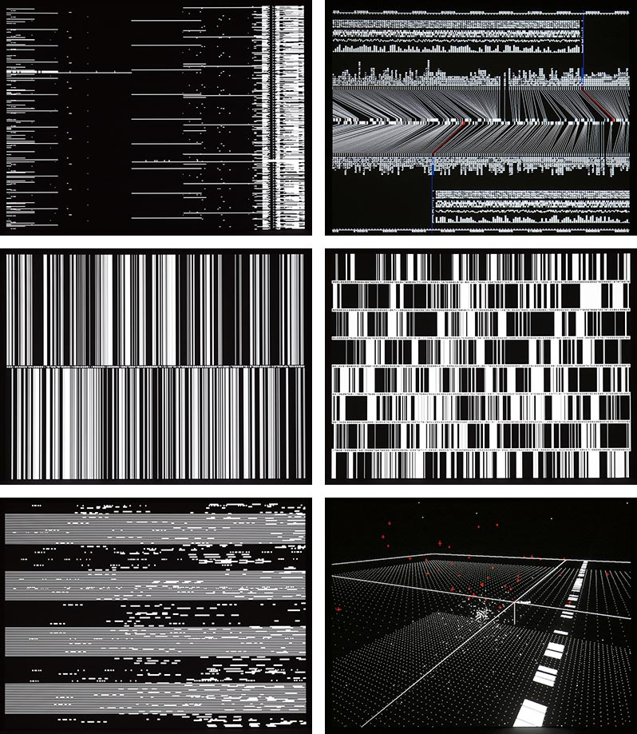
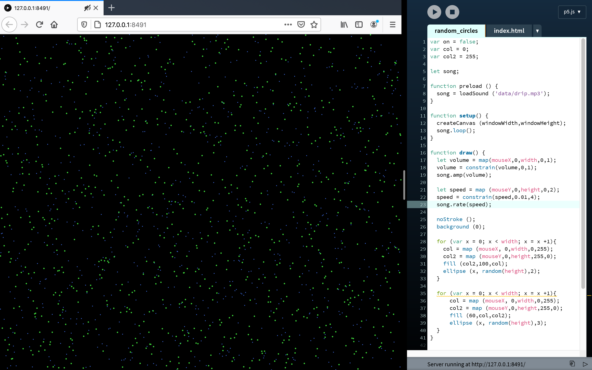

# Exploration and Experimentation - Week 06
 
## Ryoji Ikeda
This week I began to look into visual and sound art, especially the work of [*Ryoji Ikeda*](http://www.ryojiikeda.com/) and his [*datamatics*](http://www.ryojiikeda.com/project/datamatics/?fbclid=IwAR3fjztq06NIOVAcqhVfksC-cztDaakEeMaU3bNkZ6g3TesdKGrbt7JWp5E) project "that explores the potential to perceive the invisible multi-substance of data that permeates our world. It is a series of experiments in various forms - audiovisual concerts, installations, publications and CD releases - that seek to materialise pure data."

Im hoping to take inspiration from Ryoji's use of sound in his works and implement it into my Major Project and maybe even try to create some of my own sounds/music to experiment in Processing with.

 
## Processing Experimentation 
 
Taking inspiration from the sense of atmosphere and immersion that Ryoji creates in his works I tried my hand at incorporating sound into my own work. Figuring out how to add the p5.js sound library was abit of a pain but once I got it working with Firefox (doesn't seem to work on Chrome) I think the outcome works really well using [*'Saline Drip'*](https://bblisss.bandcamp.com/track/saline-drip) an experimental ambient electronic song from Ben Bondy. Have a look at the [*outcome*](https://fergarundel.github.io/CODE-WORDS/week_06/SoundTest/) for youself, just make sure you're not using Chrome.

Next I would really like to experiment using 3D space and maybe implementing the use of a webcam/mic in p5.js, as this is my first time coding I know this is a big undertaking but I'm very interesting in how space and sound can interact in three dimensions.

## Working with Text
Using an excert from Foucault's, [*'Of Other Spaces'*](https://web.mit.edu/allanmc/www/foucault1.pdf),  I have continued to experiment in Processing with conditional statements creating a [*bouncing text box*](https://fergarundel.github.io/CODE-WORDS/week_06/foucault_test/) that will change colour whe the mouse is hovering over the dimensions of the box. Although it is a simple Processing sketch you can see how this can be incorporated into the final assignment, with text objects being interacted with and changing properties. The code can probably be cleaned up using objects but it works for now and doesn't look too messy, however that is something I will have to think about when starting my final outcome.

 
